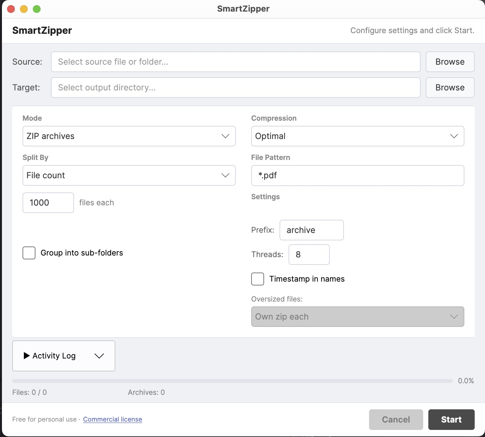

# SmartZipper

A fast, parallel file archiver for splitting large file collections into organized zip archives.

Built with .NET 9 and Avalonia UI. Runs on Windows and macOS.

---

## Features



- **Split by file count** — N files per archive
- **Split by size (MB)** — Target archive size with accurate estimation
- **Grouped mode** — Organize files into sub-folders within each zip (e.g., 10 folders of 10,000 files each)
- **Distribute to folders** — Split files into folders without compression
- **Parallel compression** — Uses all CPU cores for maximum speed
- **Oversized file handling** — Files exceeding the limit go to their own zip or folder
- **Clean, professional UI** — Light theme, SmartCopy-inspired layout
- **Standalone executables** — No installation or runtime required

## Use Case

You have 400,000 PDFs and need them organized into manageable zip archives for transfer, backup, or archival. SmartZipper splits them into structured archives with sub-folder organization — in minutes, not hours.

## Download

Pre-built binaries available on the [Releases](https://github.com/SP-NoCodeDoc/SmartZipper/releases) page:

- **Windows**: `ZipperApp.exe` (self-contained, ~94 MB)
- **macOS (Apple Silicon)**: `ZipperApp.app` (self-contained, ~111 MB)

## Build from Source

Requires [.NET 9 SDK](https://dotnet.microsoft.com/download/dotnet/9.0).

```bash
cd ZipperApp
dotnet build
dotnet run
```

### Publish standalone:

```bash
# Windows
dotnet publish -c Release -r win-x64 --self-contained -p:PublishSingleFile=true -o publish/win-x64

# macOS (Apple Silicon)
dotnet publish -c Release -r osx-arm64 --self-contained -o publish/osx-arm64
```

## How It Works

1. Scans input folder for files matching your pattern
2. Estimates chunk boundaries using file sizes (instant, no I/O)
3. Compresses all chunks in parallel across all CPU cores
4. Each file is compressed exactly once — no redundant work

For already-compressed formats (PDF, JPEG, MP4), the size estimate is highly accurate. The resulting archives will be at or very close to your specified size limit.

## Configuration

| Option | Description |
|--------|-------------|
| File Pattern | Glob filter (e.g., `*.pdf`, `*.*`) |
| Output Mode | ZIP archives or folders (no compression) |
| Split By | File count or target size in MB |
| Grouped Mode | Organize into sub-folders within each zip |
| Files/Folder | How many files per sub-folder |
| Folders/Zip | How many sub-folders per archive |
| Compression | Fastest, Optimal, or Smallest |
| Parallelism | Number of CPU threads to use |
| Oversized | Handle files exceeding size limit (own zip or separate folder) |

## License

### Personal Use — Free

Use SmartZipper for free if you are an individual using it for personal, non-commercial purposes. This includes:
- Organizing your own files, photos, documents
- Learning, experimenting, personal projects
- Non-profit or educational use

No restrictions. No time limits. No registration.

### Commercial Use

A commercial license is required if SmartZipper is used in any business, organization, or for-profit context. This includes:
- Use by employees at a company
- Use on company-owned machines or servers
- Use as part of a commercial workflow or service
- Use by government or institutional entities

**What you get:**
- License to use on any machines for one user
- All current and future updates
- Priority email support

**Contact us for pricing:** [support@nocodedoc.com](mailto:support@nocodedoc.com)

### Security & Privacy

- SmartZipper runs 100% locally — no internet connection required
- No telemetry, no analytics, no data collection
- Your files never leave your machine
- Source code is publicly available for audit

## Author

Built by **Sachin Patel** — [nocodedoc.com](https://nocodedoc.com)
